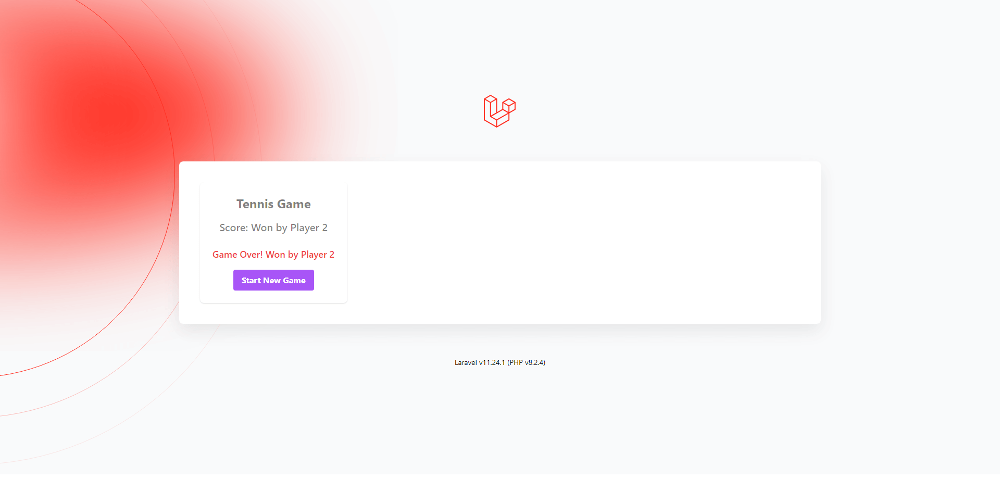
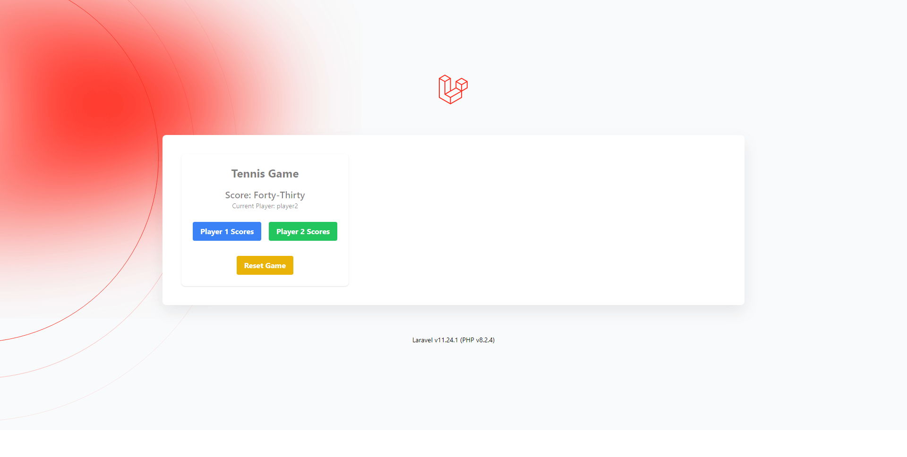

# Tennis Game App

This is a Tennis Game App written in Laravel 11.

## Setup

1. Clone the repository:
   ```sh
   git clone https://github.com/kingsleyjmtech/tennis-game-app.git
   ```

2. Navigate to the project directory:
   ```sh
   cd tennis-game-app
   ```

3. Install dependencies:
   ```sh
   composer install
   ```

4. Copy the example environment:
   ```sh
   cp .env.example .env
   ```

5. Update `.env` with your specific settings:
   Edit the `.env` file to include your actual configuration values.

6. Generate the application key:
   ```sh
   php artisan key:generate
   ```

7. Migrate and seed the database:
   ```sh
   php artisan migrate
   ```

## Testing

1.  Run the tests using the following command:
   ```sh
   php artisan test
   ```

## Screenshots






